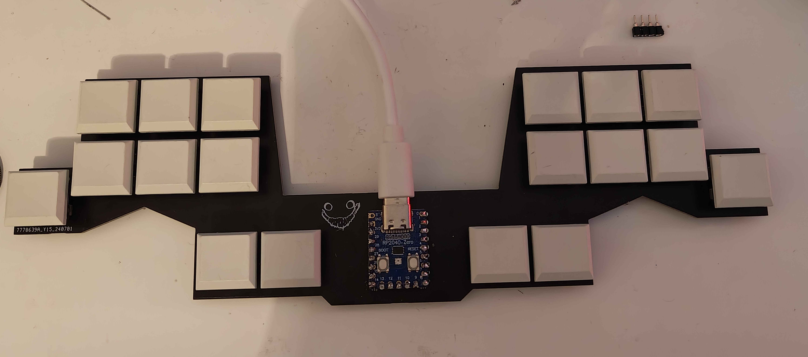
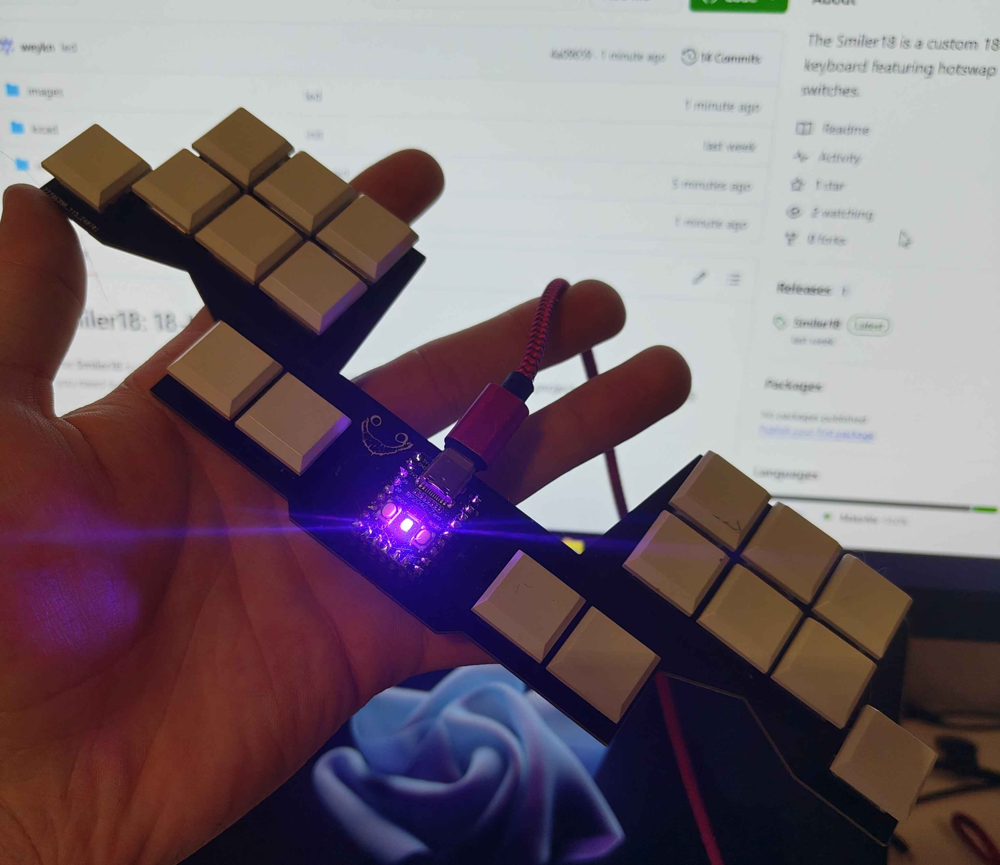
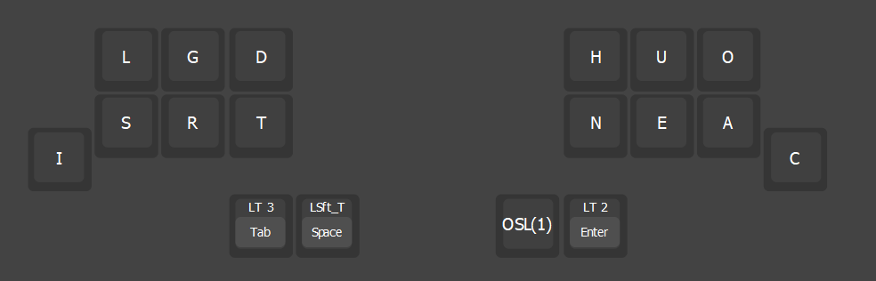
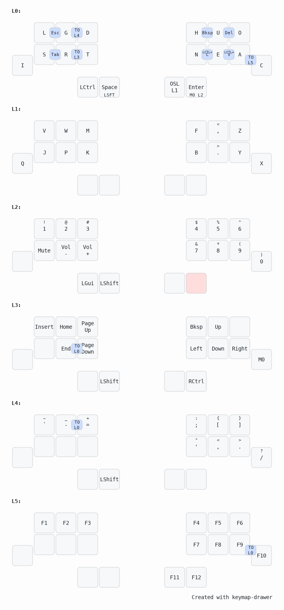

# Smiler18: 18-Key Keyboard

The **Smiler18** is a custom 18-key keyboard featuring hotswap low-profile switches. This project provides everything you need to build your own Smiler18 keyboard.

## Features
- **18 Keys**
- **Hotswap Sockets**
- **Kalih Low Profile Switches**
- **RP2040 Zero**
- **VIAL or QMK Firmware**

## Requirements
To build the Smiler18, you will need the following components:
- **1x RP2040 Zero** ([link](https://de.aliexpress.com/item/1005005106645508.html?spm=a2g0o.order_list.order_list_main.79.126b5c5fcnu92V&gatewayAdapt=glo2deu))
- **18x Kalih Choc Hotswap Sockets** ([link](https://de.aliexpress.com/item/1005006610506123.html?spm=a2g0o.order_list.order_list_main.33.451d5c5f76XTpe&gatewayAdapt=glo2deu))
- **18x Kalih Choc Switches**
- **18x Keycaps for Kalih Choc Switches**
- **(Optional) Sockets for MCU** ([link](https://de.aliexpress.com/item/4001122376295.html?spm=a2g0o.order_list.order_list_main.119.46335c5fZQ0dM3&gatewayAdapt=glo2deu))
- **(Optional) Silicone Bumpers** ([link](https://de.aliexpress.com/item/1005002619943801.html?spm=a2g0o.order_list.order_list_main.124.46335c5fZQ0dM3&gatewayAdapt=glo2deu))
- Soldering equipment and materials

## Files
You can find the necessary files for this project in the [Releases](https://github.com/weykn/Smiler18/releases/tag/main)
- **Gerber File**: For PCB manufacturing.
- **UF2 File**: For flashing the firmware onto the RP2040 Zero.
- **VIL File**: VIAL config.

## Images

